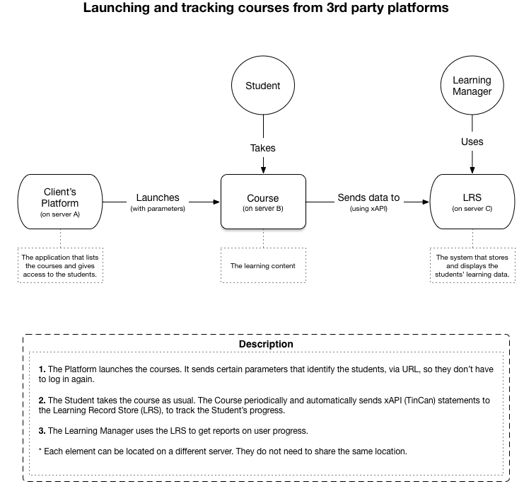

#Launching SHIFT content via 3rd party platforms

This document shows how to launch SHIFT content outside of an LMS, in a way that can be tracked by an external LRS.

It assumes that you have already set up xAPI's variables inside SHIFT. This will not work, unless those parameters are properly set.

##1. General URL format:

The content must be launched using a special URL. It is just the main file, plus an extra parameter:

`<content_base_url>?&actor=<actor>`

### 1.1. content_base_url
This is the URL to the course's tincan.html file. For example, `https://example.com/mycourse/tincan.html`.

### 1.2. actor
This is an **actor** object, with the following format:
`{mbox:<email>,name:<username>,objectType:Agent}`.  
**email** is the user's email address.  
**username** is the user's username.  
For example, `{mbox:user@example.com,name:"username"}`.  
This value must be URL encoded.

##2. Example:

`https://example.com/mycourse/tincan.html?actor=%7Bmbox%3Duser%40example.com%2Cname%3Dusername%7D`

##3. Workflow:

